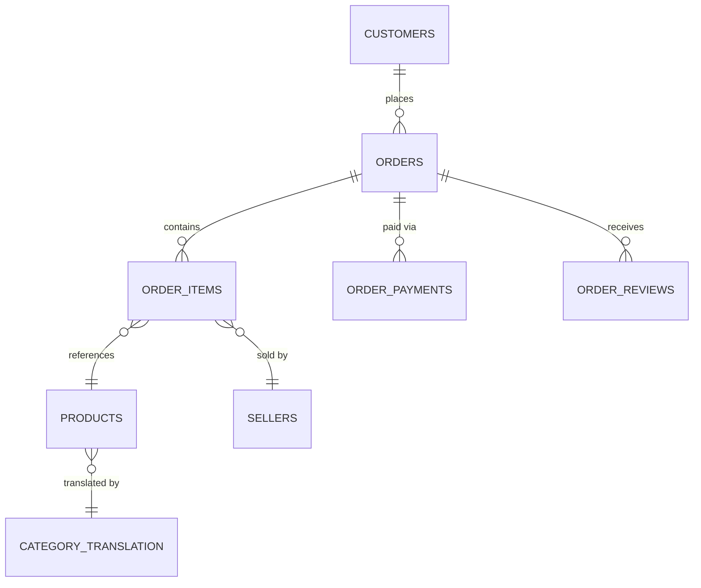

# Retail Intelligence

A business intelligence platform analyzing revenue, customer retention, and delivery operations for a Brazilian e-commerce marketplace.

## Status

🚧 Early development. Core metrics, retention, and customer segmentation analysis are complete and verified (Phases 4–5); the interactive dashboard has not been built yet — see [Core Metrics](#core-metrics) and [Customer Retention & Segmentation](#customer-retention--segmentation) below.

## Overview

E-commerce businesses generate large volumes of transactional data — orders, payments, reviews, delivery logs — but turning that into decisions requires clean data, correct metrics, and clear analysis. This project analyzes ~100,000 real orders from [Olist](https://olist.com), a Brazilian e-commerce marketplace, to answer:

> What are the biggest opportunities to improve customer experience, repeat purchasing, and revenue performance?

## Business Questions

1. How much revenue was generated, and how has it trended over time?
2. Which product categories and geographic regions drive the most revenue?
3. What share of customers make more than one purchase?
4. Are late deliveries associated with lower customer review scores?
5. Which customer segments (by recency, frequency, and monetary value) represent the best retention opportunities?

## Tech Stack

- **Python** (pandas, NumPy) — data loading, cleaning, transformation
- **SQL** (DuckDB) — analytical queries over the cleaned dataset
- **Streamlit** — interactive dashboard
- **Plotly** — visualization
- **pytest** — correctness tests for key metrics

## Dataset

[Brazilian E-Commerce Public Dataset by Olist](https://www.kaggle.com/datasets/olistbr/brazilian-ecommerce) (Kaggle, CC BY-NC-SA 4.0) — ~100k orders placed on the Olist marketplace between 2016 and 2018, covering customers, orders, order items, payments, reviews, products, and sellers.

The raw CSVs are not committed to this repository. See [data/raw/README.md](data/raw/README.md) for download and setup instructions.

## Data Model

Full exploration, cardinality checks, and data-quality findings are in [notebooks/01_data_exploration.ipynb](notebooks/01_data_exploration.ipynb). The key modelling facts:

- **`customer_id` vs `customer_unique_id`**: Olist assigns a new `customer_id` to every order, even for a repeat customer. `customer_unique_id` is the stable person-level identifier and is the only correct key for repeat-purchase, RFM, or cohort analysis.
- **`order_items` and `order_payments` are not 1:1 with `orders`.** An order can have multiple items (9.9% of orders do) and multiple payment rows (split payment methods, e.g. voucher + credit card). Joining these two tables directly on `order_id` fans out both sides and inflates revenue — each must be aggregated to one row per order *before* joining.
- **`geolocation` is a noisy many-rows-per-zip-prefix table** (avg ~53 rows per prefix), not a clean dimension — it must be aggregated to one row per prefix before any geographic join.
- All foreign keys checked (`order_items → products/sellers`, `orders → customers`) resolve with zero orphaned rows — referential integrity is solid; grain/cardinality is the real risk in this dataset.



## Cleaning & Analytical Tables

Raw CSVs are transformed into clean, validated tables by `src/cleaning.py` and written to a DuckDB database by `src/database.py` (`python -m src.database` rebuilds it from `data/raw/`). Logic lives in `src/`, not in notebooks, so it's reusable by both SQL queries and the dashboard.

**Primary analytical population.** Headline revenue, customer, AOV, retention, and delivery KPIs use **`order_status == "delivered"`** only (`orders_analytics.is_delivered`). Other statuses (canceled, unavailable, shipped, processing, invoiced, created, approved) are preserved in the same table, never dropped, so operational analysis of non-delivered orders remains possible — they're just excluded from headline "realized performance" numbers. The rule is defined once (`cleaning.COMPLETED_ORDER_STATUS` / `filter_delivered_orders`) rather than repeated ad hoc.

**`customer_id` vs `customer_unique_id`.** Olist assigns a new `customer_id` per order, so it is only valid for joining an order to its customer record. `customer_unique_id` is the stable person-level key and is the only field used for repeat-purchase, RFM, or cohort logic.

**Revenue definition.** `item_revenue = SUM(order_items.price)` — product revenue only. `freight_value` is tracked separately and is never included in revenue, and neither is ever called profit (the dataset has no cost data).

**Payments.** `order_payments` has 1+ rows per order (split payment methods); `payments_order_summary` sums `payment_value` per order before any join to item-grain data, avoiding the fan-out shown in the exploration notebook. 9 payment rows with `payment_value == 0.00` (leftover voucher remainders / `not_defined` rows) were kept, not dropped — summing a $0 row is a no-op and doesn't affect totals.

**Reviews.** `reviews_order_summary` aggregates the (mostly-but-not-quite 1:1) review rows per order into `review_count` / `avg_review_score` / `min`/`max`. Orders with no review row have no summary row, so `avg_review_score` is `NaN` after the left join — never coerced to 0.

**Products.** English category name falls back to the original Portuguese name if no translation exists, and to `"unknown"` if the product has no category at all — products are never dropped for missing category data.

**Geography.** `customers`/`sellers` city/state fields are used directly for state-level analysis. The 1M-row `geolocation` table is only aggregated separately into `geography_zip` (one row per zip prefix, median lat/lng, modal city/state) for future mapping — it is not joined into the core order tables, since doing so would multiply rows.

**Table grains**

| Table | Grain |
|---|---|
| `orders_analytics` | 1 row per `order_id` — canonical order-grain table (items, payments, reviews, delivery flags all merged in) |
| `order_items_analytics` | 1 row per order item — for product/category analysis, deliberately kept separate so multi-category orders aren't collapsed |
| `order_items_summary` / `payments_order_summary` / `reviews_order_summary` | 1 row per `order_id` — the intermediate aggregates `orders_analytics` is built from |
| `products_clean` | 1 row per `product_id` |
| `geography_zip` | 1 row per `zip_code_prefix` |

**Delivery delay** = `order_delivered_customer_date - order_estimated_delivery_date` (positive = late). Only calculated when an actual delivery date exists — `delivery_days`, `delivery_delay_days`, `is_late`, `is_on_time` are all left missing (not `False`/`0`) for undelivered orders and the 8 `delivered`-status orders with no delivery timestamp (a data anomaly).

Every table is validated on build (`src/database.py::validate_analytical_tables`): `orders_analytics` is unique on `order_id` with no row-count drift from raw `orders`; aggregated item revenue and payment totals reconcile exactly to the raw tables; delivered-order counts match the raw filter; `is_late`/`is_on_time` are mutually exclusive.

## Core Metrics

Calculated in `src/metrics.py`, cross-validated against independent SQL queries in `sql/`, and detailed in [notebooks/03_business_analysis.ipynb](notebooks/03_business_analysis.ipynb). All figures below use **delivered orders only** (see "Cleaning & Analytical Tables" above); revenue is product revenue only (`SUM(item_revenue)`, excludes freight, not profit).

| Metric | Value |
|---|---|
| Revenue | R$13,221,498.11 |
| Delivered orders | 96,478 |
| Unique customers | 93,358 |
| Average order value | R$137.04 |
| Repeat customer rate | 3.0% |
| Average review score | 4.16 / 5 (99.3% of orders reviewed) |
| On-time delivery rate | 93.2% (of 96,470 orders with a known delivery date) |
| Average delivery time | 12.1 days (median 10) |

**Repeat customer rate** = (customers with ≥2 delivered orders) / (customers with ≥1 delivered order), keyed on `customer_unique_id`. Only 2,801 of 93,358 customers repeat-purchased, and they account for just 5.5% of revenue — repeat purchasing is genuinely low in this dataset, not a measurement artifact.

**On-time delivery rate** denominator excludes the 8 orders marked `delivered` with no actual delivery timestamp (a data anomaly) — it is not computed over all delivered orders.

**Delivery delay and review scores are associated, not proven causal.** On-time/early orders average 4.29/5; late orders average 2.27/5, falling monotonically as delay increases (4.32 → 1.70 across delay buckets). This is a strong pattern in observational data, described here as an association.

Revenue is concentrated in São Paulo (38% of total, from `sql/01_revenue_analysis.sql`), and the top product category (`health_beauty`) is only 9.3% of revenue — no category or region dominates disproportionately. Full monthly trends, category rankings, and state-level breakdowns are in the notebook.

## Customer Retention & Segmentation

Detailed in [notebooks/04_customer_retention.ipynb](notebooks/04_customer_retention.ipynb) (`src/segmentation.py`, `sql/05_cohort_analysis.sql`, `sql/06_customer_segmentation.sql`).

**Traditional RFM was evaluated and rejected.** 97.0% of customers have Frequency = 1 (a single delivered order) — a quintile-based Frequency score would put nearly everyone in the same bin, contributing noise rather than signal. Recency (median 218 days, std 153) and Monetary value (heavily right-skewed: mean R$141.62 vs. median R$89.73, skew ≈ 9.7, top 10% of customers = 41.1% of revenue) do have real variation, so they're used directly instead of being forced into an ill-fitting RFM framework.

**Segmentation used instead** — behavior-based, with two documented, data-driven thresholds (75th percentile of customer revenue = "high value"; 90-day recency, matching the retention-window analysis below = "recent"):

| Segment | Customers | % of Customers | % of Revenue |
|---|---|---|---|
| High-Value One-Time | 21,661 | 23.2% | 57.8% |
| One-Time Lapsed | 55,164 | 59.1% | 29.3% |
| One-Time Recent | 13,732 | 14.7% | 7.3% |
| High-Value Repeat | 1,679 | 1.8% | 4.7% |
| Repeat Customer | 1,122 | 1.2% | 0.8% |

A superficially uniform "97% one-time" customer base splits into very different value tiers: `High-Value One-Time` customers are less than a quarter of customers but contribute more than half of all revenue.

**Cohort retention** (month of first delivered purchase): retention drops sharply after each cohort's first month, typically to under 1%/month, with no clear improving or worsening trend across cohorts — low repeat purchasing looks structural, not a recent decline. Cells for calendar months that haven't happened yet for a cohort are left blank, never shown as 0%, to avoid implying churn that hasn't been observed.

**Retention windows, adjusted for censoring** (only counting customers who've had enough time to be observed returning): 30-day 1.6%, 60-day 2.0%, 90-day 2.3%, 180-day 3.1% — all computed with an explicit eligibility filter, since a customer whose first purchase was recent hasn't had time to return yet and shouldn't be counted against the window.

**Time to second purchase** (repeat customers only, n=2,801): median 28 days, mean 81 (right-skewed) — a different statistic from the retention windows above, since it conditions on having already returned rather than measuring the probability of returning.

## Project Structure

```
retail-intelligence/
├── app.py                  # Streamlit entry point
├── data/
│   ├── raw/                # Olist CSVs (not committed — see data/raw/README.md)
│   └── processed/          # Cleaned/aggregated tables
├── notebooks/               # Exploration, cleaning, and analysis notebooks
├── sql/                     # DuckDB analytical queries
├── src/                     # Reusable Python: loading, cleaning, metrics, charts
├── pages/                   # Streamlit dashboard pages
├── tests/                   # Correctness tests for metrics
└── assets/screenshots/      # Dashboard screenshots for this README
```

## Methodology

This project is built in phases, each verified before moving to the next: dataset exploration → data cleaning and modelling → core metric definitions → analysis of the core business questions → dashboard → advanced analytics (RFM, cohorts) → documentation. Key definitions (revenue, valid orders, repeat customers, delivery delay) are documented explicitly before being calculated, and no profit or margin metrics are reported since the dataset contains no cost-of-goods data.

## Running Locally

```bash
python -m venv .venv
source .venv/bin/activate
pip install -r requirements.txt

# Place the Olist CSVs in data/raw/ — see data/raw/README.md

streamlit run app.py
```

## Limitations

- Historical dataset (2016–2018), Brazil-only; findings are not necessarily current or generalizable.
- No cost-of-goods data, so profit/margin cannot be calculated — only revenue.
- Delivery-delay/review-score analysis is observational (association, not proven causation).
- Some orders have missing or delayed reviews, which are treated as missing data, not assumed to be poor reviews.

## Future Improvements

To be revisited once the core analysis is complete.
